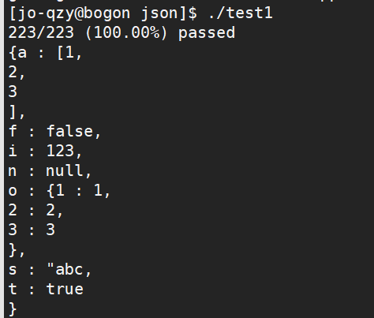

# JSON库

C++实现简单的Json库，目前实现：

- 能够解析null、true、false、数字、字符串、数组、对象
- 实现Json对象转换成字符串（Json格式字符串）（格式不够规范，继续完善，未完成非格式化输出）
- 使用方式部分同Jsoncpp相同（没有匹配完）

## 使用系统及工具

使用系统：

- CentOS 7

使用工具：

- vim
- makefile
- g++
- gdb

## 目前效果图

## 最大的收获

1. 熟悉了gbd调试
2. 学会了简单的测试单元的编写
3. 熟悉了Json库
4. 大概了解了代码重构