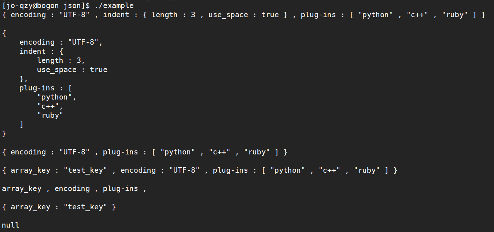

# JSON库

C++实现简单的Json库，目前实现：

- 能够解析null、true、false、数字（double）、字符串、数组、对象
- 仅支持 `UTF-8`JSON文本，仅支持`double`存储number
- 能够添加和删除Json对象
- 实现Json对象转换成字符串格式化输出
- 实现FastWriter的非格式化输出
- 接口使用大部分同Jsoncpp
- Reader部分采用了单例模式（纯粹是因为想用一下单例）

学习资料来自[miloyip大神的GitHub][link]

[link]: https://github.com/miloyip/json-tutorial/	"点击此处跳转学习资料"

## 使用系统及工具

使用系统：

- CentOS 7

使用工具：

- vim
- makefile
- g++
- gdb

## 目前效果图

### 测试用例

### 使用用例

### 内存泄漏检测

## 最大的收获

1. 熟悉了gbd调试
2. 学会了简单的测试单元的编写
3. 熟悉了C++的Json库
4. 大概了解了代码重构
5. 学会了内存泄漏检测工具
6. 实际写了一下单例模式